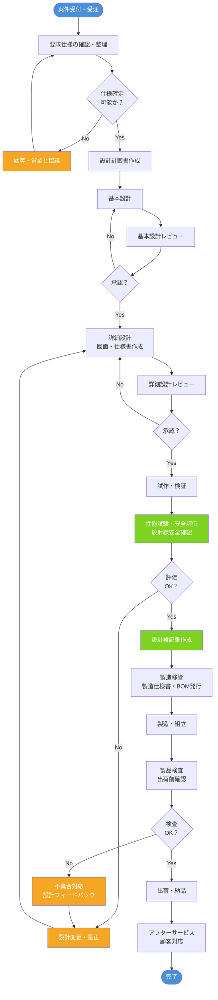

# 設計業務フロー
## 日本放射線エンジニアリング株式会社

---

## 1. フロー概要図（Mermaid）

---

## 2. 各フェーズの詳細

### フェーズ1：案件受付・要求定義

| ステップ | 内容 | 担当 | 成果物 |
|---------|------|------|--------|
| 1-1 | 案件受付・受注確認 | 営業・設計 | 受注書 |
| 1-2 | 顧客要求仕様のヒアリング | 営業・設計リーダー | 顧客要求仕様書 |
| 1-3 | 法規制・放射線安全基準の確認 | 設計・品質保証 | 適用法規チェックリスト |
| 1-4 | 仕様確定・合意 | 顧客・営業・設計 | 確定仕様書 |

### フェーズ2：設計計画

| ステップ | 内容 | 担当 | 成果物 |
|---------|------|------|--------|
| 2-1 | 設計計画書作成 | 設計リーダー | 設計計画書 |
| 2-2 | スケジュール・工数見積 | 設計リーダー | 設計スケジュール |
| 2-3 | 設計リスクアセスメント | 設計・品質保証 | リスクアセスメント表 |

### フェーズ3：基本設計

| ステップ | 内容 | 担当 | 成果物 |
|---------|------|------|--------|
| 3-1 | システム構成検討 | 設計担当 | システム構成図 |
| 3-2 | 基本設計書作成 | 設計担当 | 基本設計書 |
| 3-3 | 基本設計レビュー | 設計チーム・品質保証 | 設計レビュー記録 |
| 3-4 | 設計承認 | 設計リーダー・管理職 | 承認済み基本設計書 |

### フェーズ4：詳細設計

| ステップ | 内容 | 担当 | 成果物 |
|---------|------|------|--------|
| 4-1 | 詳細設計・図面作成 | 設計担当 | 設計図面・詳細仕様書 |
| 4-2 | 部品・材料選定 | 設計担当・調達 | 部品リスト（BOM） |
| 4-3 | 放射線遮蔽・安全設計 | 設計担当・安全管理 | 放射線安全設計書 |
| 4-4 | 詳細設計レビュー | 設計チーム・品質保証 | 設計レビュー記録 |
| 4-5 | 詳細設計承認 | 設計リーダー・管理職 | 承認済み詳細設計書 |

### フェーズ5：試作・検証

| ステップ | 内容 | 担当 | 成果物 |
|---------|------|------|--------|
| 5-1 | 試作品製作 | 製造・設計 | 試作品 |
| 5-2 | 機能性能試験 | 設計担当・品質保証 | 試験報告書 |
| 5-3 | 放射線安全評価 | 安全管理・品質保証 | 放射線安全評価書 |
| 5-4 | 法規制適合確認 | 品質保証・設計 | 適合確認書 |
| 5-5 | 設計検証書作成 | 設計リーダー | 設計検証書 |

### フェーズ6：製造移管・製造

| ステップ | 内容 | 担当 | 成果物 |
|---------|------|------|--------|
| 6-1 | 製造仕様書・手順書作成 | 設計・製造 | 製造仕様書・作業手順書 |
| 6-2 | BOM・図面の正式発行 | 設計 | 正式BOM・図面 |
| 6-3 | 製造ラインへの技術移管 | 設計リーダー・製造リーダー | 技術移管記録 |
| 6-4 | 量産・組立 | 製造 | 製品 |

### フェーズ7：検査・出荷

| ステップ | 内容 | 担当 | 成果物 |
|---------|------|------|--------|
| 7-1 | 受入検査・中間検査 | 品質保証 | 検査記録 |
| 7-2 | 完成品検査 | 品質保証・設計 | 完成品検査報告書 |
| 7-3 | 出荷判定 | 品質保証・管理職 | 出荷許可書 |
| 7-4 | 出荷・納品 | 物流・営業 | 納品書 |

### フェーズ8：アフターサービス

| ステップ | 内容 | 担当 | 成果物 |
|---------|------|------|--------|
| 8-1 | 顧客サポート・問合せ対応 | 営業・設計 | 対応記録 |
| 8-2 | 不具合発生時の設計フィードバック | 設計・品質保証 | 是正処置報告書 |
| 8-3 | 設計情報の更新・管理 | 設計リーダー | 改訂図面・仕様書 |

---

## 3. 主要ドキュメント一覧

| 文書名 | 作成フェーズ | 管理部門 |
|--------|-------------|---------|
| 顧客要求仕様書 | 要求定義 | 営業・設計 |
| 設計計画書 | 設計計画 | 設計 |
| リスクアセスメント表 | 設計計画 | 設計・品質保証 |
| 基本設計書 | 基本設計 | 設計 |
| 詳細設計書・図面 | 詳細設計 | 設計 |
| 放射線安全設計書 | 詳細設計 | 設計・安全管理 |
| 設計レビュー記録 | 各レビュー | 設計・品質保証 |
| 試験報告書 | 試作・検証 | 品質保証 |
| 放射線安全評価書 | 試作・検証 | 安全管理 |
| 製造仕様書・手順書 | 製造移管 | 製造 |
| BOM（部品表） | 詳細設計 | 設計・調達 |
| 完成品検査報告書 | 検査 | 品質保証 |
| 是正処置報告書 | アフターサービス | 品質保証 |

---

## 4. 関連法規・基準

- 放射線障害防止法
- 医療法（医療用放射線機器の場合）
- 薬機法（医療機器該当品の場合）
- JIS規格（該当品目）
- ISO 9001（品質マネジメントシステム）
- 電気用品安全法（電気設備を含む場合）

---

*最終更新：2026年6月25日*
