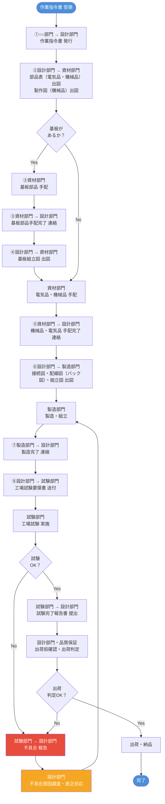

# 設計業務フロー【繰り返し品】
## 日本放射線エンジニアリング株式会社

> **繰り返し品**：過去に設計が完了している製品

---

## 1. フロー概要図（Mermaid）

---

## 2. 各ステップの詳細

| ステップ | 起点部門 | 終点部門 | 内容 | 成果物・伝達事項 |
|---------|---------|---------|------|----------------|
| ① | ○○部門 | 設計部門 | 作業指令書を発行 | 作業指令書 |
| ② | 設計部門 | 資材部門 | 部品表（電気品・機械品）および製作図（機械品）を出図 | 部品表、製作図 |
| ③ | 資材部門 | 設計部門 | 基板部品の手配完了を連絡 ※基板がある場合のみ | 基板部品手配完了連絡 |
| ④ | 設計部門 | 資材部門 | 基板組立図を出図 ※基板がある場合のみ | 基板組立図 |
| ⑤ | 資材部門 | 設計部門 | 機械品・電気品すべての手配完了を連絡 | 手配完了連絡 |
| ⑥ | 設計部門 | 製造部門 | 接続図・配線図（バック図）・組立図を出図 | 接続図、配線図（バック図）、組立図 |
| ⑦ | 製造部門 | 設計部門 | 製造完了を連絡 | 製造完了連絡 |
| ⑧ | 設計部門 | 試験部門 | 工場試験要領書を送付 | 工場試験要領書 |
| ⑨ ※補足 | 試験部門 | 試験部門 | 工場試験を実施 | 試験記録 |
| ⑩ ※補足 | 試験部門 | 設計部門 | 試験完了報告書を提出（不合格の場合は不具合報告） | 試験完了報告書 / 不具合報告書 |
| ⑪ ※補足 | 設計部門・品質保証 | — | 出荷前確認・出荷判定 | 出荷判定記録 |
| ⑫ ※補足 | — | 顧客 | 出荷・納品 | 納品書 |

> ※⑨〜⑫は添付資料に記載のない補足ステップです。実態に合わせてご確認ください。

---

## 3. 基板あり／なしの分岐まとめ

| 条件 | 追加ステップ | 内容 |
|------|------------|------|
| **基板あり** | ③〜④ | 資材部門が基板部品を手配し完了を連絡 → 設計部門が基板組立図を出図 |
| **基板なし** | スキップ | ②の後、直接⑤（機械品・電気品の手配完了連絡）へ進む |

---

## 4. 用語定義

| 用語 | 定義 |
|------|------|
| 繰り返し品 | 過去に設計が完了している製品 |
| 機械品 | 板金関係の部品 |
| 電気品 | 基板、スイッチ、ランプ、表示器、センサ、ケーブル等の部品 |
| バック図 | 配線図（盤内背面の配線を示す図面） |
| 工場試験要領書 | 工場での試験手順・合否基準を定めた文書 |

---

## 5. 補足・確認事項

以下の点は定義が不明確なため、実態に合わせてご確認ください。

- **「○○部門」**：作業指令書を発行する起点部門（営業部門・生産管理部門など）を明記してください。
- **試験不合格時の対応フロー**：設計部門が是正した後、製造部門へ差し戻す範囲を確認してください。
- **出荷判定の承認権限**：品質保証のみか、設計リーダー・管理職の承認も必要かを確認してください。
- **試験完了報告書の提出先**：設計部門以外（品質保証・顧客）への提出が必要かを確認してください。

---

*最終更新：2026年6月25日*
